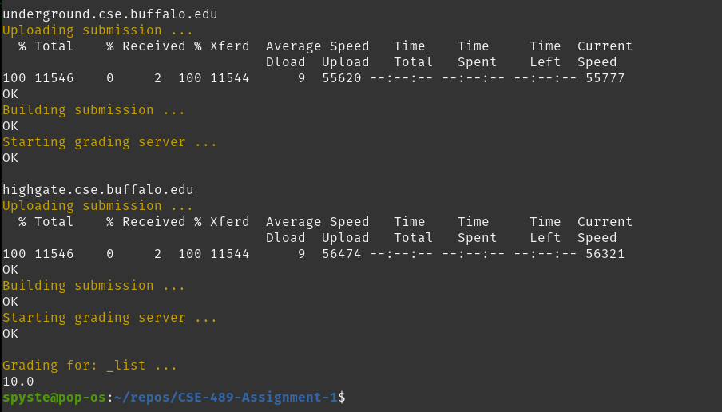

# Programming Assignment 1 Stage 1 Report

## CSE 489/589

### 1. Group and Contributions

wbecker2 Contributions: Worked on network communication and startup.  
terckert Contributions: Mainly focused on execution of select statements and skeleton.
We both worked on the implementation of the command functions.

### 2. SHELL Functionality

### Application Startup

In order to start up either a server or client you must call `./assignment1 <s/c> <port>`. This will then create a new instance of either the server or the client object with `ChatServer(argv[2])` or `ChatClient(argv[2])`, and call it app. The class constructors do the shared start up responsibilities. These include: setting local machine state information; connecting to the local port provided in the function call; getting the host's IP address and host name; and setting some global values. With app when then call the function `run()`, which is our process to run on the host. This function is implemented as a shared virtual function in ChatApp with ChatClient and ChatServer implementing their specific version. The two versions do share a general flow of action. They will do some more class specific connections, set up streams, and then wait for commands or messages.

### 3. Test Results

### AUTHOR

Author is defined in our base case ChatApp as `ChatApp::author(const char* command_str){...}`. We use this to print and log the output as expected.  

### IP

IP is defined in our base case ChatApp as `ChatApp::display_ip(const char* command_str){...}`. We use this to print and log the output as expected.

### PORT

Port is defined in our base case ChatApp as `ChatApp::print_port(const char* command_str){...}`. We use this to print and log the output as expected.

### LIST

List is defined in our child case ChatClient as `ChatApp::print_list(const char* command_str){...}`. We use this to print and log the output as expected. This requires us to loop through the vector we use to store the list of connected clients locally on the client.

### LOGIN EXCEPTION HANDLER

The handling of login exceptions is done in two locations.The first is in our function login. This function is defined in ChatClient as `bool ChatClient::Login(LoginArgs *args){...}` where LoginArgs data type is `struct LoginArgs{char server_ip_addr[16]; char server_port_number[6];}`. Where this is used we check that the value returned from login is true which indicates that we are connected to the server. If the login is successful then we print and log the associated messages. The second location we do login exception handling is in out user input for the client. If the user command is one that requires a server connection, we check if the server's file descriptor is -1 or not. If it is -1 it indicates the client is not connected to the server and the command is refused. Otherwise the command is handled appropriately.

### REFRESH

Refresh is implemented in ChatClient. It leverages a lot of the functionality we use to login to obtain an updated list of connected clients. In our function for refresh we send a command to the server asking for the current list of connected clients held by the server. The server then receives this command and calls `send_connected_client_list(list fd)`. This then packs the data into a buffer and sends it to the client identified by fd. Back at the client, after sending the command for the list we call `receive_list()` which... receives the list and stores it locally. And finally the success and end messages are printed and logged.

### EXIT

Exit is implemented in ChatClient. The first thing it does is inform the server that this client is exiting and its state should be deleted from the server. At the server when it receives the command informing it that the client is leaving, the server will remove that client's state information. Next at the client level it closes the server's file descriptor, and finally terminates the process with code 0.
